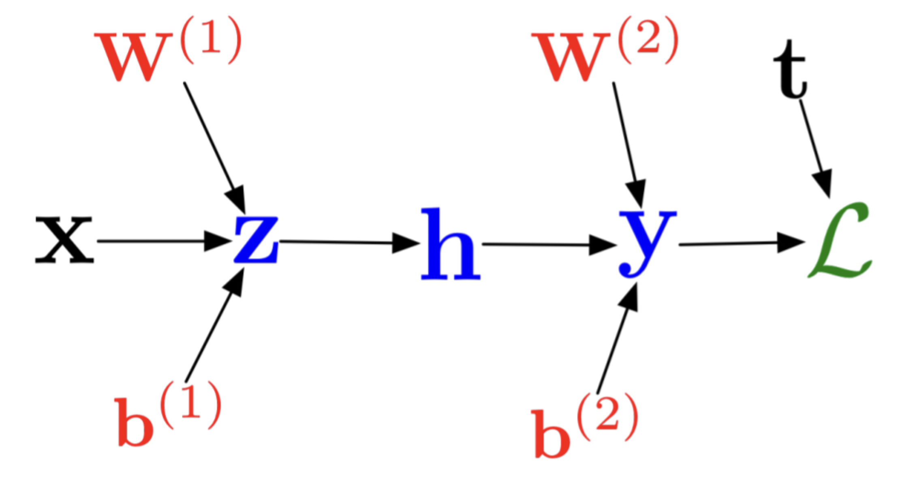

## Parameter Estimation and Reverse-Mode Autodiff
08/27/21

Fitting models to arbitrary data is incredibly important, and has many names, including:
- Parameter Estimation
- Inverse Problems
- Training

### Shooting Method
Assume some model *u = f(p)* where *p* = parameters, with some data *y* that you want to fit your model to.

*Shooting Method:* apply a cost function *C(p) = *||*f(p) - y*|| for some scalar loss function *C* &isin; &reals;^n &map; &reals;, and optimize to minimize the value of this cost function (in essence, supervised learning methods)

This is the basic structure of most scientific machine learning methods, where you have some unfit model that you repeatedly move closer and closer to a minimum of your cost function *C*

### Optimization Methods
There are lots of ways to optimize models via parameter updates. The following are some packages:
- `JuMP`
- `Optim.jl`
- `NLopt.jl`

Generally, there are two classes of parameter optimization:
1. **Global Optimization**: find the best overall extrema in the parameter space. This method is generally less popular
2. **Local Optimization**: find the best nearby extrema in the parameter space. This is the most common method of parameter optimization due to concerns about computational complexity

As for **local optimization**, there are two common "update" forms of parameter search algorithms:
1. **Gradient descent**: *p(i+1) = p(i) - &alpha;•(dC(p(i)) / d(p(i)))* (gradient descent)
2. **Hessian descent**: *p(i+1) = p(i) - H(p(i))^-1 • (dC(p(i)) / d(p(i)))* (l-BFGS algorithm)

#### Connection to ODE Systems
Gradient descent can be thought of as the discretization of an ODE system denoted by the following:

*p' = -(dC/dp)* => *p(n+1) = p(n) - &alpha; • dC(p(n))/dp*

### Neural Network Training
A layer in a neural network can be represented of sequences of nonlinearly activated matrix multiplications:

*layer(x) = &sigma;.(Wx + b)*

where *W* is a weight matrix, *b* is a bias vector, and *&sigma;* is a scalar activation. Even a simple network with one input layer, one hidden layer, and one output layer satisfies the "Universal Approximation Theorem" with sufficient (finite) depth or width. However, a shallow network generally requires the hidden layer to scale with O(n^2). Thus is the motivation for a multi-layer deep neural network (DNN).

#### Recurrent Neural Network
An interesting variant of the neural network form is the **residual neural network**, which is essentially the update form of a simple neural network:

*x(k+1) = x(k) + DNN(x(k), k; p)*

This is essentially the Euler discretization with &delta;t = 1.

### Computing Gradients for an Arbitrary Model
In order to perform local optimization with the shooting method, the following calculation is required:

*dC/dp = &sum;(2(f(xi,p) - yi) • df(xi)/dp)* for all samples in *i*

Examining this expression, the core computation that an optimization technique must use is *df(xi)/dp*, the gradient of each parameter with respect to the cost function.

### Estimating Gradients
#### Using Forward-mode Autodiff
For *f*: &reals;^n *&rArr;* &reals;, we use a similar technique to previous forward-mode autodifferentiation:

*d = d0 + v1•e1 + ... + vm•em*

*f(d) = f(d0) + f'(d0)•v1•&epsilon;1 + ... + f'(d0)•vm•&epsilon;m*

In other words, we propagate the partials with respect to each parameter (instead of each input) through the operations of the model, and receive *df/dp(i)* out the other side (in the form of a MultiDual number). Thus, a *k+1* MultiDual number can give the gradients with respect to all *k* parameters. The problem is that this approach scales relatively poorly, since it requires one execution of the function for **every** parameter, which can sometimes be an extensive list.

#### Using Backward-mode Autodiff
The "fast" method of gradient estimation has many names:
- **adjoint technique**
- **backpropagation**
- **reverse-mode autodiff**

Recalling that *df/dt = (df/dx)•(dx/dt) + (df/dy)•(dy/dt)*, you can chain the contributions of each operations to "unroll" your network, finding the gradient of each parameter separately. The primitive of the reverse-mode autodifferentation is the `vjp` (vector Jacobian product).

If a model is a composition of functions, *f*: fL•fL-1•...•f1 &rArr; *J = JL(JL-1(...(J1)...))*. This composition results in two different paradigms for reverse- and forward-mode autodifferentiation:
- **Forward-mode**: *Jv = JL(JL-1(...(J1v)...))*, propagating through front-to-back, *J1* &rArr; *JL*
- **Reverse-mode**: *vT•J = (...((vT•JL)JL-1)...)J1*, propagating backwards, *JL* &rArr; *J1*

The primitive operation of reverse-mode autodifferentiation is the **pull-back function**:

*xb(i) = &del;L/&del;x = &sum;(&del;L/&del;yi • &del;yi/&del;xi)* for all sums into *x* in *y*

#### Example for Simple *f(x) = Ax*, *L(y) =* ||*y - t*|| Case
Given that the primitive of reverse-mode autodiff is the `vjp`, the procedure looks as the following to calculate the Jacobian with respect for the loss:
1. Seed output *L(y)* with value of 1
2. Backprop through loss function: *v2 = 2*|*y - t*|
3. Compute the `vjp`: *xb = v2T • A*

#### Example for simple neural network case
The above computes the Jacobian with respect to a neutral loss value. In order to find the actual parameter updates of a generic neural network for a training value with the following forward pass for *f*: *x &map; y*:

**Forward pass**
1. *z = W1•x + b1*
2. *h = &sigma;(z)*
3. *y = W2•h + b2*
4. *L = (1/2)•*||*y - t*||*^2*

The following is a visual representation of this network:

So in essence, a neural network with two layers and a single nonlinear activation. Then, the backward pass looks as the following:

**Backward pass**
1. *Lb = 1*
2. *yb = Lb(y - t)*
3. *W2b = yb•(hT)*
4. *b2b = yb*
5. *hb = W2T • yb*
6. *zb = hb .• &sigma;'(z)* (where *&sigma;'* is the derivative of the activation function)
7. *W1b = zb • xT*
8. *b1b = zb*

where *b1b* and *W1b* are the gradients for the input weight and bias matrices, and *b2b* and *W2b* are the gradients for the output activations and bias. These operations can continue indefinitely backwards, providing a general approach to updating neural networks of *n* layers.

### Multiseeding
Similar to forward-mode with multiple seeded derivative directions, we can use backpropagation with a seeded matrix, *A = [v1 v2 ... vn]T* where *vi* is a basis vector. In essence, this allows you to pass through multiple training examples simultaneously through your neural network, and if your network uses generalized linear operations, no change is needed, and your network can switch automatically to `BLAS3` operations

### When to use FM vs RM Autodifferentiation
There is a significant difference between these two approaches in terms of efficiency:
1. **Reverse-mode pullback**: gives the rows of Jacobian, i.e. it operates on one output variable at a time
2. **Forward-mode pushforward**: gives the columns of Jacobian, i.e. it operates on one parameter variable at a time

The decision to use forward-mode or reverse-mode autodifferentiation often depends on the shape of the Jacobian: for *f*: *&reals;^n &map; &reals;^m*, with a Jacobian of shape *&reals;^(mxn)*, the following factors should motivate the choice of optimization method:
- if *m << n*, use reverse-mode (when parameters far outnumber outputs, and Jacobian has few rows)
- if *n << m*, use forward-mode (when outputs far outnumber parameters, and Jacobian has few columns)

When *n ~ m*, forward-mode is usually the better choice due to its lower memory overhead (since intermediate values are not stored)

However, since optimization often requires the gradient of the cost *C* with respect to each parameter, backpropagation usually ends up being part of the standard toolkit regardless

#### Side-note on mixed-mode
There are situations where mixing FM and RM can give a better result, for example when the Jacobian matrix is sparse except for 3 rows, and 3 columns. Thus, you would use forward-mode for the columns and reverse-mode for the rows
