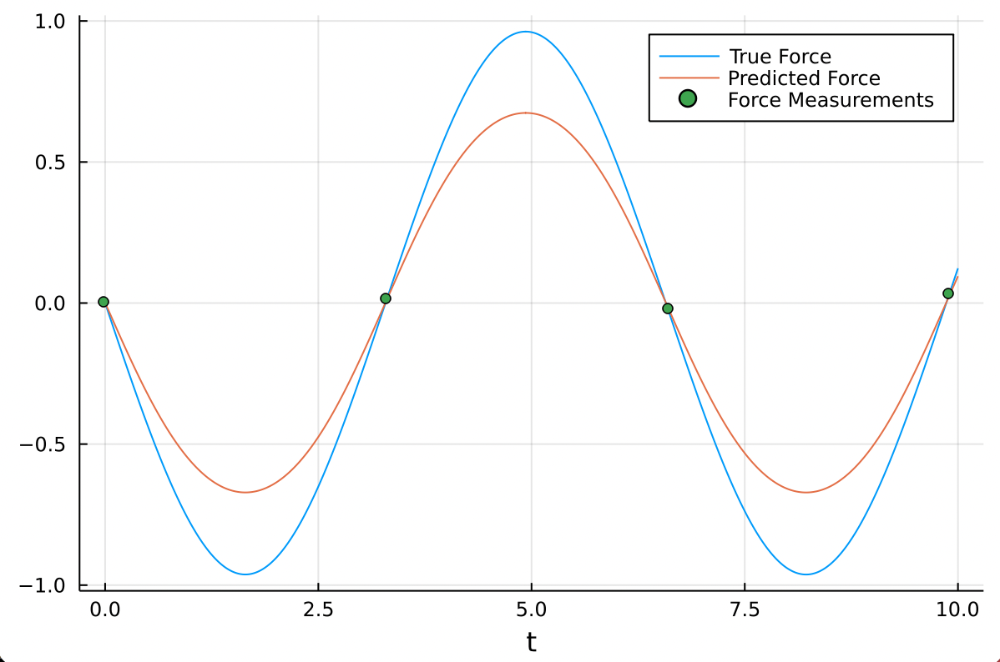
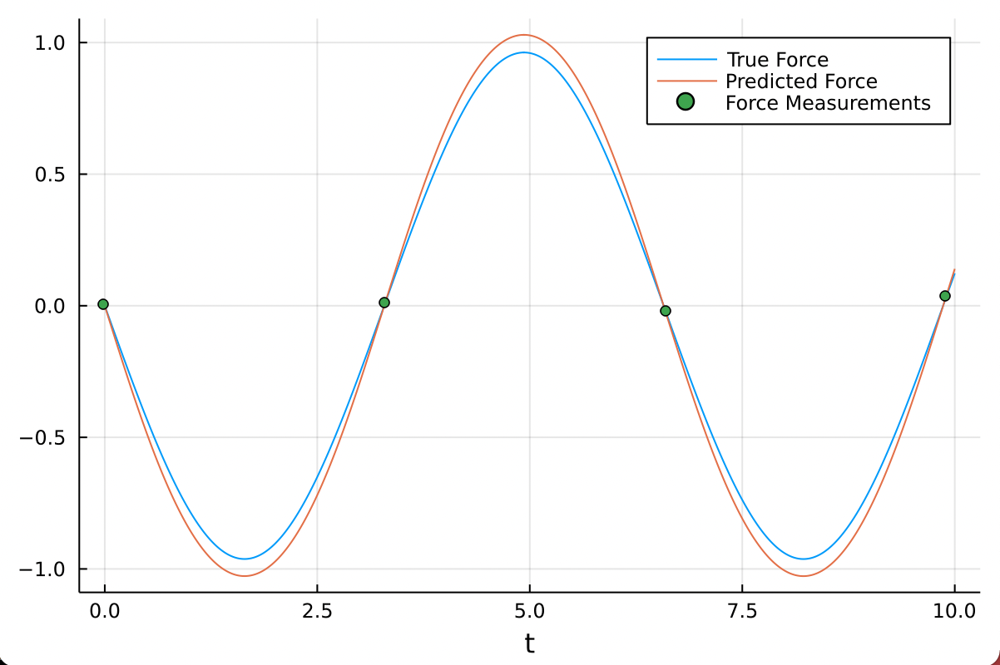

## Intro to Scientific Machine Learning
08/10/21

This lecture goes over a quick introduction to neural networks, their applications to scientific modeling, and some details of implementation in Julia

### Neural Networks (in general)
A NN is just a function:
```
NN(x) = ...(W3 * A2(W2 * A1(W1 * x + b1) + b2) + b3)...
```
Where:
- `An` = nonlinear activation for layer n
- `Wn` = weight matrix for layer n
- `x` = input
- `bn` = bias vector for layer n

The above can be easily programmed with native Julia code (but is not as easy to manage and edit compared to the `Flux.jl` library). At its core, a neural network takes in a vector `x` of length N and outputs a vector `NN(x)` of length M

### `Flux.jl` Library
Flux is the Julia machine learning library, which uses native Julia code built on top of existing Autodiff libraries. 

A neural network can be defined using `Flux` using the following syntax:
```
NN = Chain(Dense(10, 32, tanh),
           Dense(32, 32, tanh),
           Dense(32, 5)
           )
```
i.e., you define a **chain** of layers, defined by an input size, output size, and (optionally) an activation function.

### Digging into `Dense` layer
The `Dense` layer is, fundamentally, a struct, which can be called using a functor (callable struct). The definition of `Dense` is stored as a struct containing a weight matrix, a bias matrix, and a callable function (which may be defined anonymously) as the activation. The functor for the dense layer is defined within Julia as the following:
```
function(a::Dense)(x::AbstractArray)
    w, b, sig = a.w, a.b, a.sig
    sig.(w*x + b)
end
```
The above functor is called by some object `a:>Dense`

### Digging into `Chain` object
The `Chain` object is a mechanism for recursively calling the layers that it contains (which are held within a `Tuple` object). The `Chain` is defined as the struct:
```
struct Chain{T:>Tuple}
    layers::T
    Chain(xs...) = new{typeof(xs)}(xs)
end
```
The `Chain` writes the `Tuple` of layers passed as parameters as an attribute called `layers`. The recursive operation over these layers is conducted in a clever way:
```
applychain(::Tuple{}, x) = x
applychain(fs::Tuple, x) = applychain(tail(fs), first(fs)(x))
```
The `applychain` function, if the passed tuple is not empty, applies the first function to the input then passes this result to the `applychain` function along with a tuple of the remaining elements. When the passed tuple is empty, the input itself is returned. This recursive mechanism is included in the `Chain` operation as the following:
```
(c::Chain)(x) = applychain(c.layers, x)
```

Since tuples themselves are immutable, a constant indexing of these structures (i.e. `tup[1]` vs `tup[i]`) can be compiled away, meaning that the type inference engine of Julia can optimize these operations with consideration for the type of these elements. The name for abstraction that is compiled away is "zero-cost abstraction" (even though there is a small cost due to the function calls).

### Training with `Flux.jl`
Training is relatively simple, with a minimum working example (for the network defined above):
```
loss() = (...) # returns a scalar value
p = params(NN)
Flux.train!(loss, p, Iterators.repeated((), 10000), ADAM(0.1))
```
Since Julia is fast enough to run a machine learning procedure directly, implementation of these networks in Julia is correspondingly simple

### Why Neural Networks
The obvious question is "why would we use neural networks for a given task?". There are several valid answers to this question:
1. Neural networks satisfy the **Universal Approximation Theorem** (UAT) which means that a neural network of large enough size can approximate any continuous function to arbitrary accuracy
2. Neural networks don't scale as horribly with the size of the problem. For approximate models such as high order polynomials or Fourier series, the size of the required systems scales polynomially with the size of the problem (O(n^m)) rather than exponentially (O(m^n)) which means that for a given problem of order n, there is some value of n for which a neural network is preferable to other function approximation schemes
3. The architecture of neural networks is flexible enough to encode inductive biases into the structure of the network (allowing easier optimization). e.g., if a function outputs only possible values, it is relatively trivial to constrain the network to only positive outputs
4. Neural network libraries are highly optimized (great optimizers, GPU acceleration, varied architectures, ...)
5. Local optimization works very well for finding high quality, often global solutions

### A case study into physics informed neural networks (PINN)
Physics informed neural networks (PINNs) take on the task of parametrizing dynamics equations (ODEs, PDEs) with neural networks, with the key innovation using physical knowledge to enhance training when data is sparse. It does so by defining some neural network:
```
NN = Chain(...)
```
Then defining a dynamics equation in terms of that neural network and an initial condition:
```
g(t) = u_0 + t*NN(t)
```
This isn't the important innovation of these networks, however. You can define a normal accuracy function for the network:
```
loss() = mean( abs2( ((g(t) - f(t)) ) for t in 0:step:range) )
```
Which makes sure that your function is accurate at all timepoints. This produces the following unsatisfactory result:



With this formulation, you are telling your training routine: find **a** function that fits the specified dynamics. You can further emphasize "fit a function that fits **my** dynamics by adding a component of your loss that complements the physical system being studied. For a spring system, you might enforce Hooke's law:
```
# Hooke's law loss
loss_ode() = sum(abs2,NN(x) - (-k*x) for x in positions)

# combine loss functions
λ = 0.1 
composed_loss() = loss() + λ*loss_ode()
```

Which produces a much better fit:


The lesson to take away from this short look into PINNs is that there a stark contrast between the way that neural networks are used in industry (big focuses on classification, predicting output) and in scientific machine learning as function approximators (focus on fidelity, use of previous physical laws). Further work in this course will use these core principles over and over
