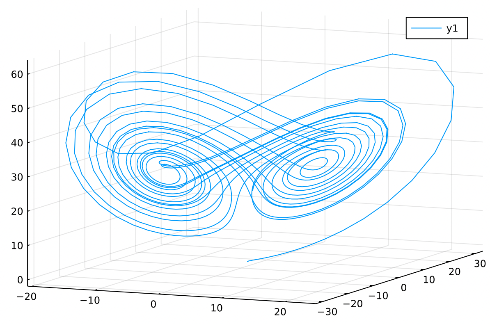

## Intro to Scientific Machine Learning
08/10/21

The basis of most physical models are dynamic systems, with equations describing the rates of change of given variables with respect to other variables. In this lecture:
1. Basic properties of discrete dynamical systems
2. Understanding stability in dynamical systems
3. Efficient implementation of discrete dynamical systems (in code)

### What is a discrete dynamical system?
A discrete dynamical system is defined by a relationship of the form: `u_n+1 = model(u_n, n)`, where a future state of the system is described by an initial state and a series of discrete updates

*Example 1:* an autoregression model called AR1 is defined by the relationship **u(n+1) = &alpha;•u(n) + &epsilon;(n)**, where **&alpha;** is a constant and **epsilon;(n)** is a number generated from a random normal distribution

*Example 2:* a recurrent neural network (RNN) is a discrete timeseries defined by **u(n+1) = u(n) + f(u(n), &theta;)** where **f** is a neural network parametrization and **&theta;** is the set of model parameters

### Properties of Linear Dynamical Systems
Take a simple system **u(n+1) = &alpha;•u(n)** or **u(n+1) = &alpha;^n•u(n)**. If **||&alpha;|| < 1**, then the system approaches a stable equilibrium of 0. If **||&alpha;|| > 1**, then the system diverges to infinity. This intuitively makes sense.

### Properties of Nonlinear Dynamical Systems
The key question is: how do nonlinear update equations behave as t -> infinity?

To answer this, we turn to Banach's Fixed Point Theorem. This theorem states the following:

If function **f** is a contraction (i.e., **d(f(x), f(y)) < d(x, y)**), then there exists x' where f(x') = x'. This point, x', is known as a fixed point, and it is unique for the neighborhood where it is found.

### Linear Discrete Stability
Proof of the Banach Fixed Point Theorem (and that all functions with continuous derivatives have a fixed point as t -> infinity):

1. Take **f**, where **f** has a Lipschitz continuous derivative and **x(n+1) = f(x(n))**
2. Assume that **||f'(x)|| < 1** for some region of x
3. Thus, since **||f'(x)|| < 1** in some region of x, we can construct the relationship **||(f(y) - f(x)) / (y - x)|| <= 1**
4. This can be rearranged to show that **||f(y) - f(x)|| <= ||y - x||** in some region of x. This is the same as the contractive formulation given above!

There are two implications of this result:
- For a function with a continuous derivative, a region of **||f'(x)|| < 1** results in one fixed (stable) equilibrium point as t -> infinity. This is because any continuous function with that derivative behavior looks locally contractive
- Most functions are locally linear if they have a friendly enough looking derivative. Locally, a function with these properties (Lipschitz Continuous) will look like the function **x(n+1) = f'(x)(x(n))** locally in the region of **x(n)**

It might be expected that a completely different formulation would be needed for an "update equation", but in reality an update equation is usually just a shifted form (**x(n+1) = x(n) + f(x(n)) = g(x(n))**) and it can be rationalized about essentially the same way

### Multivariable Systems
However, single variable systems are very limited in use: most (interesting) systems involve systems of multiple variables

Let x be a number from the domain R^(k) with **x(n+1) = f(x(n))** where **f** is a linear dynamics matrix from the domain R^(k x k), with an update equation **x(n+1) = A•x(n)**. There's an easy way to evaluate the stability of these systems using eigenvalue decomposition:

1. Decompose **A** into the diagonalization **P^-1 • D • P**, where **D** is the diagonalization of eigenvalues and **P** is the square matrix of eigenvectors
2. Incorporate this diagonalization into the original update equation: **x(n+1) = A • x(n) => x(n+1) = P^-1 • D • P • x(n) => P • x(n+1) = D • P • x(n) => z(n+1) = D • z(n)** where **z(i)** is the product of the eigenvector matrix and the original set of variables
3. Since D is diagonal, this original set of interdependent linear variables has been converted to a system of k *independent* dynamic systems. Thus the stability criterion is very simple: for the system to approach a stable equilibrium, *ALL* eigenvalues **||D(i)|| < 1**. In other words, if **D** is contained within the unit circle

In other words, using standard linear algebra toolsets, it's very easy to examine the stability of even complex systems. Now I will discuss some variants of these multivariable systems

### Delayed Systems
A delayed system is defined by a set of relationships between **x(i)** and some set of precursor values **x(i-j)** where j is a vector of some set of integers, all 0 or greater. Since this set of relationships goes all the way back, you can do simplification and reduce the dependence of **x(n)** to dependent *only* on **x(n-1)**

### Stochastic Dynamical Systems
If one variable is stochastic (meaning semi-random) you can do a similar derivation as above by looking at the expected values of your random inputs. Otherwise, the stability analysis is essentially the same

### Quick Description of Periodicity and Chaos
Some dynamical systems are periodic, where values bounce back and forth with some period *n* (for example, when the update equation multiplies the input by a negative number). An extension of this idea is that a chaotic system can be defined as a periodic system where the period *n* -> infinity.

### Efficient Implementations of Discrete Dynamical Systems
A few things are needed for efficiency within Julia. The biggest thing to keep in mind is that you must somehow preserve the type information in and out of your dynamics system *f*, so that the compiler can infer what is coming in and out of your dynamics system. This is relatively easy for a single-dimensional system

### Extending this to Multidimensional Systems
For this case-study, we are looking at the discretized form of the Lorenz attractor system over a period of 1000 timesteps. I will include three different implementations along with their runtimes, and some details on why different implementations are more or less efficient

#### Base implementation
**35 microseconds**
```
function solve_system_save(f, u0, p, n)
    u = Vector{typeof(u0)}(undef,1)
    u[1] = u0
    for i in 1:n-1
        push!(u, u[i], p)
    end
    return u
end
```
This implementation uses a "Vector of vectors" which is mutable in size in order to store and return each snapshot of the Lorenz system. This results in a system with the following appearance:



Using a matrix rather than a Vector of vectors is about the same in terms of efficiency, as long as you remember to use matrix views rather than naive slicing (so that memory is not unnecessarily allocated. However, memory must still be allocated periodically for this Vector, which decreases the efficiency

#### In-place Variant
**6.5 microseconds**
```
function solve_system_save(f, u0, p, n)
    du = similar(u0)
    for i in 1:n-1
        f(du, u, p)
        u, du = du, u # or equivalently, u .= du
    end
    return u
end
```
The in-place variant only helps **if** you only need the endpoint of your system, and not every point along the way. If you are going to return all 1000 timesteps, you can't avoid allocating those at some point. If you *do* only want the endpoint, then you can gain a lot of efficiency by only allocating for your temporary variable *once*, and reusing it over and over (but this does require you to define a function which changes `du` in place)

#### Static Variant
**8 microseconds**

If system is small (<10 elements) storing as static arrays can be beneficial. In this form, you would input the initial state as an `@SVector u0`, your dynamics function `f` would output `@SVector du`, and you would return a Vector of static vectors `Vector{SVector} u` which contains the solutions to the system. Since space can be allocated on the stack for ~no cost, this is far more efficient than allocating space for your solutions on the heap (if you have enough space on the stack, that is).

Adding `@inbounds` macros (removing bounds-checking) can further reduce the runtime by about 33% more, resulting in a runtime nearer to **5 microseconds**, which is great
