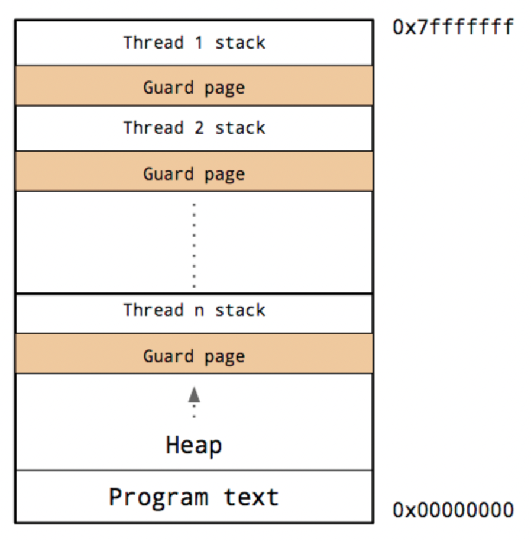

## Single Node Parallel Computing
08/13/21

Parallel computing seeks to extend Moore's Law by increasing efficiency in parallelization across multiple CPU cores. In this lecture:
1. Describe parallelism at a high level and when it makes sense to use each type
2. Use multithreading to parallelize discrete dynamics simulation

### Structure of Processes and Threads
- Concurrency: interruptability
- Parallelism: independentability

The hierarchy of a process is described by this image:



A **process** consists of a discrete running instance of a program. The process controls the overriding resources, such as the program data and heap (dynamically allocated) memory. Within this process, there are anywhere from 1 to many compute threads that have their own stack and virtual CPU to perform operations. The process can only operate in one "**context**" at a time, and must switch between threads (and their corresponding stack memories)

Processes are the lowest level of an OS operation, and are as varied as the possible programs taking place on a given computer. 

*Data Handling* is an example of a process where convurrent non-parallel (**green**) threads show up often. The process will open a thread to pass messages to and from some data handling peripheral (such as SSD or a GPU) and does not proceed until the thread is complete (otherwise it might move forward before the data is actually transferred)

*Main Event Loop* is a process paradigm used by Julia, as well as languages such as JS or Go, where the instance of the language is at its core, a single event loop that is constantly looking for work. An instance of a Julia program is just a "green" process thread initialized by this loop. The subroutine continues, and can only be broken back to the main event loop at a yield point (essentially a dynamic allocation or a print statement).

- **Javascript** has yield points essentially after every line, since the language is driven by accepting and manipulating I/O input
- **Julia** minimizes yield points, reducing them to mainly allocations and print statements, since Julia is more performance-centered

### Asynchronous Example
Threads can be called to perform some work then terminate. Example:
```
using Base.Threads
@time begin
    a = Vector{any}(undef, nworkers())
    @sync for (idx, pid) in enumerate(workers())
        @async a[idx] = remotecall_fetch(sleep, pid, 2)
    end
end
```
`@async` creates a "green" thread, and `@sync` demands that all created green threads are finished before moving on

#### Types and rationale of simple threaded operations
1. **Async + Non-blocking**: I/O operations
2. **Async + Blocking**: Threaded atomics
3. **Sync + Blocking**: Standard compute and @sync macro
4. **Sync + Non-blocking**: webservers with I/O (no "completion" checks)

### Multithreading
Each thread has a separate stack but a shared heap. Since threads can share heap objects with essentially no cost, this allows "*shared memory computing*" to have potential for efficiency boosts. For this set of notes, we will use the `StaticArray` Lorenz system as an example:

In theory, `du` vector computation can be parallel; i.e., `u[1]`, `u[2]`, etc. can be calculated in parallel and combined. Unfortunately, threads need to pass their values via the heap, so this approach doesn't make sense. Thus, instead, we preallocate the space on the heap and change it in-place:

```
using Base.Threads
function lorenz_mt!(du, u, p)
  α,σ,ρ,β = p
  let du=du, u=u, p=p
    Threads.@threads for i in 1:3
      @inbounds begin
        if i == 1
          du[1] = u[1] + α*(σ*(u[2]-u[1]))
        elseif i == 2
          du[2] = u[2] + α*(u[1]*(ρ-u[3]) - u[2])
        else
          du[3] = u[3] + α*(u[1]*u[2] - β*u[3])
        end
        nothing
      end
    end
  end
  nothing
end
```
In fact, **this version is far slower compared to the simple serial version!** This is because spinning up a thread takes time, and if each thread has very little work to do, the cost of spinning up each thread will far outweigh the computational benefit.

### Data-Parallel Problems
Not all problems translate well to parallelism: in order for a problem to translate very well to parallel computing, threads must be able to do a fair amount of work without checking with each other, but often computational problems will not be amenable to independence. One example (close-to-home) are dynamic systems, where x(t+1) might be directly dependent on the value of x(t), so you must be very clever to parallelize across time in dynamic problems

Dynamic systems are called "embarrassingly parallel" when they are being evaluated across different sets of inputs (either input parameters or initial conditions). For example, say for the Lorenz system we want to evaluate the mean value of the three system variables across the 1000 studied timesteps.

**Problems to dodge**
1. We might be tempted to make one cache variable (as before) for the 1000 system states as a Vector of `StaticArrays`. This is a mistake, since threads actually share this heap memory! We need caches for each of the independent threads
2. We can actually use the rest of the timeseries solver relatively intact, with the only difference being that we use a global cache variable to store output.

**Implementation**
```
using StaticArrays, BenchmarkTools
# statically allocated dynamics function solver
function lorenz(u,p)
  α,σ,ρ,β = p
  @inbounds begin
    du1 = u[1] + α*(σ*(u[2]-u[1]))
    du2 = u[2] + α*(u[1]*(ρ-u[3]) - u[2])
    du3 = u[3] + α*(u[1]*u[2] - β*u[3])
  end
  @SVector [du1,du2,du3]
end

# in-place trajectory solver
function solve_system_save!(u,f,u0,p,n)
  @inbounds u[1] = u0
  @inbounds for i in 1:length(u)-1
    u[i+1] = f(u[i],p)
  end
  u
end

# in-place statically allocated mean trajectory function, one for each thread
const _u_cache_threads = [Vector{typeof(@SVector([1.0,0.0,0.0]))}(undef,1000) for i in 1:Threads.nthreads()]
function compute_trajectory_mean(u0,p)
    solve_system_save!(_u_cache_threads[Threads.threadid()],lorenz,u0,p,1000);
    mean(_u_cache_threads[Threads.threadid()])
end

# generate random sets of parameters to search over
ps = [(0.02,10.0,28.0,8/3) .* (1.0,rand(3)...) for i in 1:1000]

# conduct parameter search multithreaded
using Base.Threads
function tmap(f,ps)
  out = Vector{typeof(@SVector([1.0,0.0,0.0]))}(undef,1000)
  Threads.@threads for i in 1:1000
    out[i] = f(ps[i])
  end
  out
end
@btime threaded_out = tmap(p -> compute_trajectory_mean(@SVector([1.0,0.0,0.0]),p),ps)
```
1. First, a `StaticArray` version of the Lorenz dynamics equations called `lorenz`
2. An in-place variant of the time-evolution solver, which mutates `u` in-place to generate the 1000 vector timeseries
3. A mean trajectory program, which generates a cache of timeseries `StaticArray` vectors, and uses cache elements of this vector mutated in-place to calculate timeseries values, which are then averaged
4. A threadpool loops, which statically allocates threads (determined at compile time) which allocates parameter searches across threads and stores them inside a new heap-allocated array

In this case, this simple parallelization generates an approximate order of magnitude increase in speed

### Dynamic Thread Scheduling
Previous multithreading we looked at was limited to static scheduling, where schedule is laid out at compile time. Julia can also dynamically allocate threads at runtime, using the `@spawn` macro.

- **Dynamic Scheduling**: (`@spawn`) better for task with variable compute length (though with more overhead per thread allocation due to processing at runtime)
- **Static Scheduling**: (`@threads`) better for task of consistent length (less overhead since Julia plans threading at compile time)

### Array-based Parallelism
Even the simple operation `A*B` uses parallelism under the hood! If your computer has multiple cores, most matrix operations (above a certain size) will get allocated to threads on all cores

These matrix operations are called **BLAS** operations (Basic Linear Algebra Subroutines):
- **BLAS1**: Elementwise operations, scale with O(n)
- **BLAS2**: Matrix-vector operations, scale with O(n^2)
- **BLAS3**: Matrix-matrix operations, scale with O(n^3)

While these operations are highly optimized for parallel computation, these still can cause significant computational overhead, and this tends to be where GPU compute is brought in.

### Summary
Easiest parallelism operations are:
1. Embarrassingly parallel problems
2. Array-level parallelism (BLAS)

In future lecture, we will discuss the "not-so-easy" versions of parallelism
