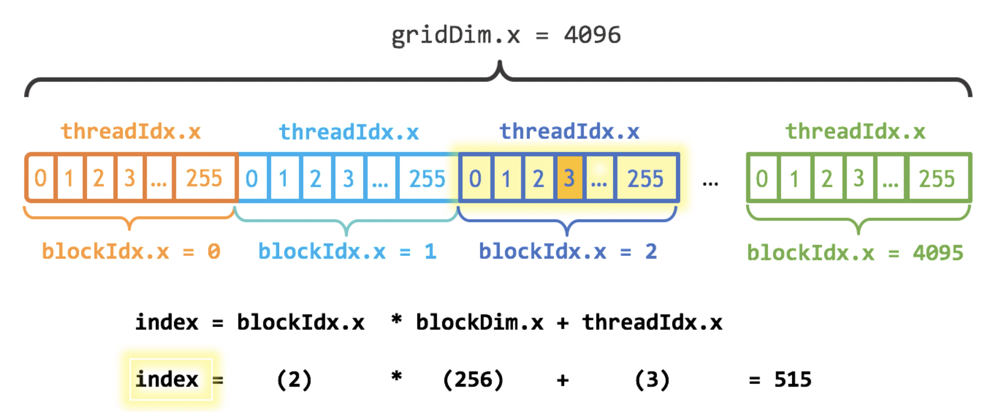

## Types of Parallelism
08/17/21

This lecture provides a high-level overview of the different styles of parallelism, how they work, what applications they should be used for, and the benefits and drawbacks of each paradigm

### Lowest Level: SIMD
SIMD is "Single Instruction Multiple Data", which is a type of parallelization performed *within* one processing unit. Certain CPUs (most modern CPUs) have the ability to perform multiple operations simultaneously on appropriately structured data, often automatically with the Julia compiler

Using `@code_llvm fun(args)` can reveal when SIMD is used, and it's usually marked by some sort of operation like `OP <4 x type>` or something similar. Generally, SIMD optimization will happen automatically, you just need to be somewhat conscious of how your data is stored to make it easier for the compiler to find opportunities to implement it

### Second Level: Multithreading
All processes have threads and one heap, and multithreading is a way to speed computation for tasks that have significant "downtime" or can be done independently. Generally, there is some overhead to spin up a thread (O(100 ns)) thus threading, while almost always possible, is not always a **good** idea. 

*Additional complication*: memory access style was prior assumed to be a "shared heap" (**UMA**) uniform memory access system, which means that heap allocated variables are automatically shared among threads. Especially with some older HPC resources, this may not always be the case, and **NUMA** paradigms are a system where multiple heaps exist and more care must be taken to localize computation on each thread

#### Implementations of Multithreading
You must use the following to activate threading:
```
using Base.Threads
```

The naive implementation uses bare threading attached to some looping mechanism:
```
acc = 0
@threads for i in 1:10_000
    global acc
    acc += 1
end
```
However, this naive implementation generates an accumulated count that is significantly less than 10,000. The problem lies in the fact that `acc` is read multiple times at each value (i.e., it is read many times before it is written to) across multiple threads. This is a common problem with multithreading, and there are several approaches to overcoming this:
1. Atomics
2. SpinLock
3. ReentrantLock

#### Atomics
Atomic values limit reading and writing simultaneously across threads by design:
```
acc = Atomic{Int64}(0)
@threads for i in 1:10_000
    atomic_add!(acc, 1)
end
```
This locks the computations across threads to happen serially rather than in parallel, which certainly has a consequence for efficiency. However, this is the fastest method of overcoming simultaneous read/writes across threads

#### Spinlock
Spinlocks are a method of preventing code from proceeding past a lock point until all other threads have entered and left the section. The implementation is also simple:
```
const acc_lock = Ref{Int64}(0)
const splock = SpinLock()
@threads for i in 1:10_000
    lock(splock)
    acc_lock[] += 1
    unlock(splock)
end
```
This is considered an "unsafe" heap control method, since with a small error, a thread could lock all future computations and the process will hang. This usually happens when a thread which called a `lock` attempts to place another `lock`, and finds itself locked out

#### ReentrantLock
The `ReentrantLock` is a safer alternative to the naive spinlock method, since a single thread cannot lock itself out by placing a second lock:
```
const acc_lock = Ref{Int64}(0)
const rsplock = ReentrantLock()
@threads for i in 1:10_000
    lock(rsplock)
    acc_lock[] += 1
    unlock(rsplock)
end
```

The speed of each method (slowest to fastest) is as follows:
1. **ReentrantLock**
2. **SpinLock**
3. **Atomics**
4. **Serial**

Serial is obviously the fastest because, if your program can be performed serially (like the above example) do it that way! The existence of too many locks, unlocks, and atomics may imply that you have not properly parallelized your program, and you need more work in order to take advantage of parallelization

### Multithreading Summary
- Communication is performed on the (shared) heap. Locks and atomics allow simple message passing between and among threads
- There is 50-100 ns overhead to spin up a thread, so a good rule of thumb is that a computation should take >1&mu;s in order to justify multithreading
- Be careful of thread ordering (don't assume any, even random task ordering) and R/W conflicts

### GPU Computing
GPU acceleration is often used to accelerate computation, especially in instance where linear algebra operations are the rate determining step of your program (which GPUs happen to excel at)

GPUs work by running the exact same program (also called a kernel) on different parts of data. This parallelization paradigm is referred to as **SMPD** (Single Program Multiple Data). For this reason, control flow tends to be detrimental to GPU operations. If, for example, an `if...else` statement is used, **both** branches will be computed, with some thrown away depending what branch of the conditional is kept (this is obviously horrible for efficiency). GPUs usually have a common heap, but unequal memory access speeds for the heap depending on which GPU node is used (**NUMA** memory model). Further, the CPU and GPU often have to pass data back and forth.

### SPMD Kernel Generation
Core parallel GPU programming model: use CUDA (or another kernel language) to make `.ptx` kernels, which is then used by all cores of the GPU. CUDA is a C++-like language which is the most popular language for contructing GPU kernels.

Julia actually allows CUDA kernels to be written in native Julia code using the `CUDA.jl` package (since Julia is compiled to the LLVM standard using `@code_llvm`, it is a relatively straightforward translation). The following is an example addition CUDA kernel:

```
using CUDA

# create tensors
N = 2^20
x_d = CUDA.fill(1.0f0, N)
y_d = CUDA.fill(2.0f0, N)

# define in-place GPU addition
function gpu_add2!(y, x)
    index = threadIdx().x
    stride = blockDim().x
    for i = index:stride:length(y)
        @inbounds y[i] += x[i]
    end
    return nothing
end

# use function
fill!(y_d, 2)
@cuda threads=256 gpu_add2!(y_d, x_d)
all(Array(y_d) .== 3.0f0) # evaluates to True
```

The key to understanding the kernel approach is `threadIdx` and `blockDim`. The GPU essentially assigns parts of the task to cores of the GPU, then strides over the input tensor and hands out these tasks in order:



You never specify the global function, but rather only how the kernel will interact with each individual chunk of data. This gives the programmer leeway to optimize the algorithm to a greater extent by dealing with each low-level computation in a direct way

### Array-based GPU Computing
The simplete version of GPU compute is not kernel-based (as above) but array based:
```
A = rand(100, 100); B = rand(100, 100)
using CUDA
cuA = cu(A); cuB = cu(B)
cuC = cuA * cuB
C = Array(cuC)
```
In order, these are the order of each of these operations:
1. Make a CPU array
2. Move this array to the GPU with `cu(...)`
3. Perform normal array operations on GPU arrays
4. Move back to CPU with `Array(...)`

Typically, moving CPU/GPU tensors to GPU/CPU takes O(50 &mu;s) in each direction. The rule of thumb is that you should use GPU computations only for calculations which take near 1 ms or more, or else re-use GPU memory frequently

### GPU Compute Summary
1. Individual GPU cores are slow, much slower than CPU cores
2. GPUs are programmed with an SPMD (single program multiple data) paradigm
3. Generally, GPUs are used mainly for linear algebra operations
4. Suitable for GPU computations of 1 ms or longer

### Third Level: Multiprocessing
Whereas multithreading uses many threads within the same process, multiprocessing will use many processes across sometimes separate machines. This means **no** shared heap, and all communication must be performed via message passing. There are several paradigms of multiprocessing programming:
1. Explicit memory handling
2. Implicit memory handling
3. Distributed Array-based Parallelism
4. Map-Reduce model
5. SPMD kernel Parallelism

#### Explicit Memory Handling
Explicit memory handling uses the **Master-Worker** model. This is the simplest model, and what Julia's `Distributed` library defaults to:
```
# define 4 new worker processes with Distributed
using Distributed
addprocs(4)
```

The simplest model of explicit memory handling is:
- A master defines a job
- Gives the job to all workers
- Receives back a value

The two options within Julia are (1) `pmap` and (2) `@distributed` looping. These are performed with `Distributed.@spawn` or `remotecall` and `fetch` under the hood. To run a method on a remote process (in this case, process 2):
```
@everywhere f(x) = x .^ 2
t = remotecall(f, 2, randn(10))
```
The above is a "non-blocking" operation which creates `t` as a `Future` object, whereas to actually return the computed value you would make a blocking call to `fetch` as `xsq = fetch(t)`

#### Implicit Memory Handling
Some frameworks, rather than requiring data handoffs to be explicitly defined, generate the computational graph for the programmer automatically. This graph, called a Directed Acyclic Graph (**DAG**), includes data transferring operations automatically in the computational graph. Some of the frameworks which utilize this method is as follows:
- Tensorflow
- dask ("distributed tasks")
- `Dagger.jl`

A short example using `Dagger` is shown as follows:
```
using Dagger

# define operations
add1(value) = value + 1; add2(value) = value + 2; combine(a...) = sum(a)

# define computational graph
p = delayed(add1)(4)
q = delayed(add2)(p)
s = delayed(combine)(p,q)

# collect value through computational graph
collect(s)
```

#### Distributed Array-Based Parallelism
High level primitives are included in the Julia type `SharedArray`, which can be used as another abstraction layer to aid complex message passing across parallel processes. While `DistributedArrays.jl` is the simplest parallel array type, `Elemental.jl` is better for more complex distributed linear algebra

#### Map-Reduce Models
The core function of this model is to:
1. Map a function onto groups of values
2. Reduce this value to a scaler

Many metrics fall into this "map-reduce" category, such as variance, averages, sum of squares, etc. These are primarily used for "Big Data" operations. Hadoop and Spark are some of the primary libraries for this parallelization framework, though Julia can also perform these operations:
```
# statically scheduled variant
@distributed (+) for i in 1:1000
    rand()^2
end

# dynamically scheduled variant
pmap(i -> rand()^2, 1:1000)
```

The dynamic vs. static versions are the multiprocessing analog of `Threads.@threads` vs. `Threads.@spawn`

#### MPI: Distributed SPMD Model
MPI is the main way to do very high-performance multiprocessing at scale, which has its roots in the C/Fortran days. Julia has `MPI.jl`, which gives access to this interface

MPI consists of a network of processes which all share the exact same program, with syncs using blocking communication. While MPI is the faster multiprocessing protocol, it is not "safe" in the sense that processes can wait on one another, causing the program to hang. The following is an example MPI program using Julia:
```
using MPI
MPI.Init()

comm = MPI.COMM_WORLD
rank = MPI.Comm_rank(comm)
size = MPI.Comm_size(comm)

dst = mod(rank+1, size)
src = mod(rand-1, size)

N = 4

send_mesg = Array{Float64}(undef, N)
recv_mesg = Array{Float64}(undef, N)

fill!(send_mesg, Float64(rank))

# non-blocking code
rreq = NPI.Irecv!(recv_mesg, src, src+32, comm)
print("$rank: Sending $rank -> $dst = $send_mesg\n")
sreq = MPI.Isend(send_mesg, dst, rank+32, comm)

# blocking sync code
stats = MPI.Waitall!([sreq, rreq])

print("$rank: Received $src -> $rank = $recv_mesg\n")

MPI.Barrier(comm)
```

### Summary of Multiprocessing
- Master-worker model is Julia's `Distributed`
- Map-reduce is a data-handling model
- Array-based computations are another abstraction
- MPI is a SPMD model, with independent and equal processes

### Summary of Parallel Programming Models
- **Map-reduce parallelism** (`pmap`, MapReduce, Hadoop, Spark)
    - *Pros*: easy-to-use
    - *Cons*: **only** mapping/reduction operations (mean, variance, max)
- **Array-based parallelism** (SIMD, CuArray, `PyTorch.torch`, `DistributedArray`)
    - *Pros*: easy-to-use, fast for defined functions
    - *Cons*: Less low-level control, restricted to implemented function
- **Loop-based Parallelism** (`Threads.@threads`, `@distributed`, OpenMP)
    - *Pros*: easy-to-use, almost no code changes
    - *Cons*: control flow like locks can be complex and breaking, less control over parallel scheduling
- **Task-based Parallelism, Implicit Handling** (`Threads.@spawn`, Tensorflow, `Dagger.jl`)
    - *Pros*: High level implementation, easy to define computational graph
    - *Cons*: **Much** harder without shared memory
- **Task-based Parallelism, Explicit Handling** (`Distributed.@spawn`)
    - *Pros*: Control over data transfers (with easier and lower-level optimization)
    - *Cons*: Requires manual data transfer, hard to scale to 1000+ nodes since only one node manages data scheduling
- **SPMD kernel parallelism** (CUDA, MPI, KernelAbstractions)
    - *Pros*: focus on optimizing expensive linear algebra operations on GPU, TPU, which are often the rate-limiting operations in a program
    - *Cons*: Only works on blockwise computations, and hard to implement control-flow without compromising efficiency or safety
