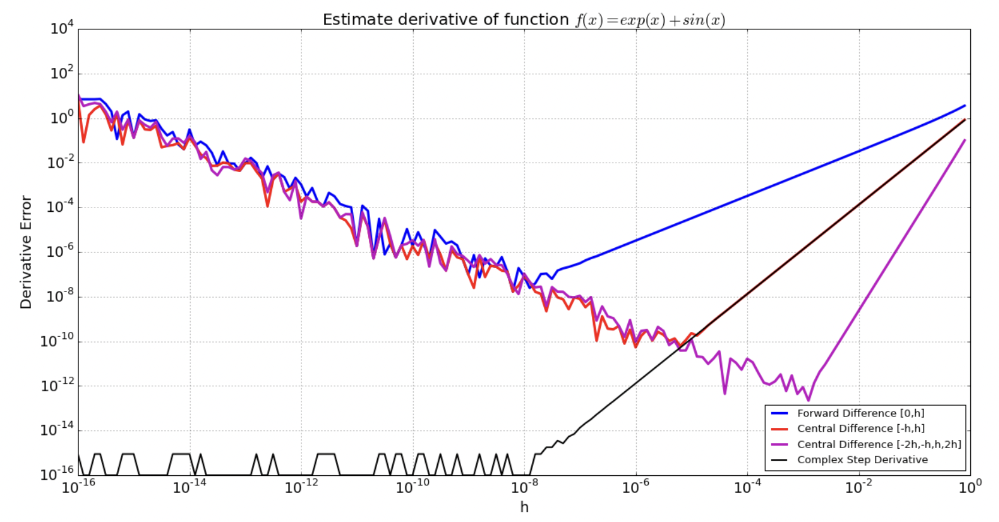

## Forward-Mode Autodifferentiation
08/24/21

In this lecture, we will discuss the forward-mode autodifferentiation method. This technique is incredibly useful for scientific computing, and is what allows automatic differentiation in very complex optimization procedures while expending relatively minimal computing power

### Machine Epsilon and Roundoff Error
Generally, 64-bit floats will retain ~16 digits of decimal accuracy. To measure this, we can define machine epsilon: **1 + &epsilon; = 1**, which is the largest value of &epsilon; where this relation holds

Roundoff error is most significant during addition and subtraction operations. For example, if two values, **x1** and **x2** are added, with **x1** >> **x2**, then you can lose some or all of your significant figures from your smaller number during addition. For example, if O(**x1**) = 10^10 and O(**x2**) = 1, you can lose all but 16 digits of accuracy from **x2** following addition or subtraction operations, since only the most significant 16 digits are kept from the sum.

### Finite Differencing and Stability
We can define an asymptotically accurate finite differencing scheme using the definition of a derivative and a small &epsilon;:

f'(x) = lim as &epsilon; -> 0 ((f(x + &epsilon;) - f(x)) / &epsilon;)

This is called the forward finite differencing scheme. However, given the previous discussion of machine roundoff error (and limited digits of accuracy on float values), choosing an optimal value of &epsilon; can be challenging:
- O(&epsilon;^2) truncation error => if &epsilon; too large, the definition doesn't hold
- O(1/&epsilon;) roundoff error => if &epsilon; too small, have lots of roundoff error

The sum of these two errors can be visualized for different methods below:



Generally, the best point is near sqrt(E), which tends to keep about 8 digits of accuracy. However, it is also clear from the above graph that there exists a method that does not suffer from roundoff error for small &epsilon;: this is "complex-step differentiation". If we instead step some amount in the complex direction, we can eliminate the roundoff error inherent in the addition. This can only be used in certain instances, and requires working with functions that are complex analytic.

### Derivatives as "nilpotent" Sensitivity
The derivative of f(x) is essentially the sensitivity of the function f to changes in input x. With a Taylor expansion around f(x0):

f(x0 + &epsilon;) = f(x0) + f'(x0)&epsilon; + O(&epsilon;)

Higher order derivatives are analogous, in that the n-th derivative represents the sensitivity to change in input for the (n-1)-th derivative

### Dual Numbers
**Dual Number**: a multidimensional number where the function's sensitivity (derivative) is propagated along with the value of the number itself. In other words, a dual number stores a number and its derivative with respect to the input variable some distance backwards

```
struct Dual{T}
    val::T
    der::T
end
```

We must then also define algebraic operations for these dual numbers (simple addition and subtraction, as well as more complex product and quotient rules to propagate derivative). These algebraic definitions are not shown here. The good thing about using a structure like this in Julia is that Julia can compile away the abstraction, treating it essentially as a Julia tuple with slightly different algebraic properties

Using these dual numbers we can define the derivatives of operations with the chain rule and incorporate these operations into an existing autodiff scheme. This is shown for the trivial case of an exponential below:
```
import Base:exp
exp(f::Dual) = Dual(exp(f.val), exp(f.val)*f.der)
```

#### Derivatives of Arbitrary Functions
Using Dual numbers to estimate derivatives of functions is thus easy:
```
derivative(f, x) = f(Dual(x, one(x))).der
derivative(x -> 3*x^5 + 2, 2)
```
Where the variable is fed into the function as a Dual number with a derivative of unity, and sensitivities are propagated through the operations of the function

#### Higher Order Derivatives
A similar technique can be used to determine the sensitivities of functions to several different input values, where f: ℝ^n -> ℝ. An example function is shown below:
```
f(x,y) = x^2 + x*y
```

In this situation, we want to determine the &part;f/&part;x and &part;f/&part;y at a given point (x0, y0). A simple way to do this is to define subfunctions:
```
f1(x) = f(x, y0)
f2(y) = f(x1, y)
```

Then to find the derivatives of these functions, we simply pass these functions and their corresponding values to the derivative function defined above:
```
derivative(f1, x0) => 10
derivative(f2, y0) => 3
```

As a general rule (as seen above), finding the gradient (&nabla;) of a function f: ℝ^2 -> ℝ requires n separate calls to the derivative function. This can be made more efficient by generalizing the `Dual` struct to a `MultiDual` struct for functions with n inputs:
```
using StaticArrays
struct MultiDual{N,T}
    val::T
    derivs::SVector{N,T}
end
```

In other words, this `MultiDual` object holds a scalar value and that value's sensitivities to several separate input variables. This struct has its own separate but very similar set of algebraic operations, with vectorized sensitivity propagation. Then, to use this new formulation:
```
g(x,y) = x^2*y + x + y
xx = MultiDual(x1, SVector(1.0, 0.0))
yy = MultiDual(y1, SVector(1.0, 0.0))
```

#### Vector output functions and ForwardDiff.jl Library
You could generalize the above formulation even more to allow for vector outputs, but all the above functionality and more are implemented in the `ForwardDiff.jl` library, where gradients can be easily computed for arbitrary functions:
```
using ForwardDiff, StaticArrays
ForwardDiff.gradient(xx -> ((x, y) = xx; x^2*y + x*y), [1.0, 2.0])
```
Where this function call returns the senstivity of the function to input variables x and y at x0 = 1.0 and y0 = 2.0

### Forward-Mode as 'jvp'
For f: ℝ^n -> ℝ, the basic operation is the direction derivative:

lim as &epsilon; -> 0 (f(**x** + &epsilon;**v**) / &epsilon) = [&nabla;f(**x**)]•**v**

Where &epsilon; is a scalar and &nabla;f(**x**) is the direction of the derivative. For example, to find &nabla;f([x0, y0]), you find both partials for x and y at x0 and y0 with the initial derivatives set to [1.0, 0.0] and [0.0, 1.0] respectively.

In fact, this formulation is identical to the Jacobian (total derivative) f'(x)•v! To find the complete Jacobian matrix, you simply find the sensitivity of each output value [y1 ... yn] to each input value [x1 ... xn] for all n basis vectors [e1, e2, ..., en]
```
for all f in f(x) = (f1(x), f2(x), ..., fm(x)) for f: ℝ^n -> ℝ^m
    f(d) = f(d0) + J*e1*eps1 + J*e2*eps2 + ... + J*en*epsn
```
The same technique can be used for higher order derivatives such as the Hessian by expanding the Taylor series around f(d0) even further.

### Example Application: Newton's Method for Nonlinear Optimization
Say our goal is to solve f(x) = 0 for f: ℝ^n -> R^m. In general, we can't solve nonlinear dynamics functions with a closed-form solution, so we are forced to use an iterative techniques: x1 -> x2 -> ... -> x'

Instead, we use a linear approximation method, where we assume local linearity within our solution. We start at x0, follow the tangent line to x1 where f(x1) is 0, and continue this optimization until x(n) = x(n+1):

f(x1) = f(x0 + &del;) = f(x0) + Df(x0)•&del; + O(||&del;^2||) => solve for J&del; = -f(x0)

This is implemented below:
```
using ForwardDiff, StaticArrays

function newton_step(f, x0)
    J = ForwardDiff.jacobian(f, x0)
    δ = J \ f(x0)

    return x0 - δ
end

function newton(f, x0)
    x = x0

    for i in 1:10
        x = newton_step(f, x)
        @show x
    end

    return x
end

ff(xx) = ( (x, y) = xx;  SVector(x^2 + y^2 - 1, x - y) )

x0 = SVector(3.0, 5.0)

x = newton(ff, x0)
```

### Summary
In this lecture, we dug into the underlying data structures and operations behind forward-mode autodiff, and explored the different ways to use forward-mode autodiff to enable gradient estimation of arbitrary functions in Julia. We also looked at an example use-case of autodiff in a Newton fixed-point solver, estimating the linear Jacobian function using automatic differentation
