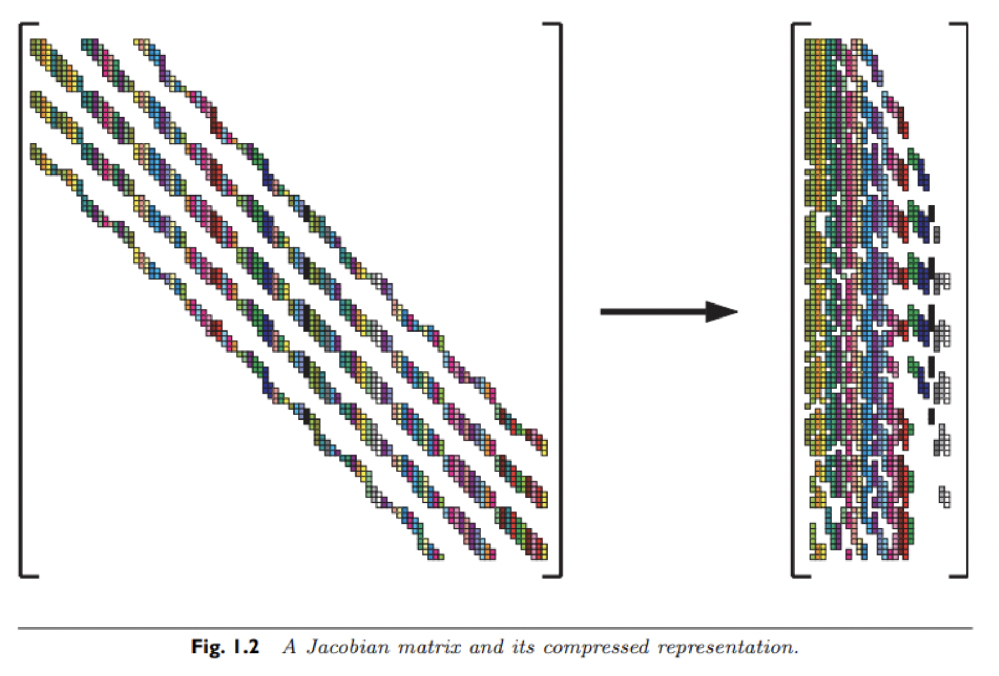

## Forward-Mode Autodifferentiation
08/26/21

There is a fundamental limitation when applying explicit integration methods to stiff ODE systems. Usually, solving these large dynamical systems is the most expensive part of complex programs, and so these solvers deserve a lot of optimization

### Newton's Method and Jacobians
Recall tht implicit Euler defines an iteration of the form:

u(n+1) = u(n) + &delta;t * f(u(n+1), p, t + &deltat)

or equivalently, after rearrangement:

g(u(n+1)) = 0

After we formulate the problem in this structure, we can then use normal rootfinding algorithms to find the solution. Since fixed-point solvers (e.g., Picard's method) suffer from stability issues, usally some form of Newton iteration is used for problems where convergence may be an issue:

x(k+1) = x(k) - J^-1 • g(x(k))

Solving for the next timestep x(k+1) using this rootfinding algorithm consists of two distinct steps:
1. Solve J • a = g(x(k)) for a
2. Update g(x(k)) using a, where x(k+1) = x(k) - a

The Jacobian can be described simply as a linear combination of two matrices:

J = I - &gamma; • df/du

Where &gamma; = &delta;t for implicit Euler integration.

### Generating Jacobian
Generating the Jacobian is a challenge for which there are multiple tools available:
1. Finite Differencing
2. Forward Autodifferentiating
3. Backward Autodifferentiating (which is not covered in this lecture)

Since a Jacobian is essentially a matrix representation of the dependencies between different variables, all of the above derivative methods can be used (in slightly different ways)

#### Finite Differencing
Finite differencing can be used to calculate the effect on derivatives using a small perturbation to one input variable into the Jacobian. In other words, for each standard basis vector e(j) (which for 3 dimensions, might look like [0, 0, 1] or [0, 1, 0]), the j-th column of the Jacobian can be calculated using the following:

(f(x + h • e(j)) - f(x)) / h

This would need to be repeated m times for an *nxm* Jacobian, resulting in a total of m+1 calls to the derivative function f.

#### Forward-mode Autodiff
With forward-mode autodiff, all of these calculations can be calculated simultaneously in one call to the derivative function:

f(d) = f(x) + J(1)•&epsilon;(1) + ... + J(m)•&epsilon;(m)

Where d is the linear combination of all basis vectors, so that we seed the differentiation direction of each value along a perturbation in the positive direction of an input value. In effect, we are determining what an infinitesimal change to one input variable (say, x1) has on all other variables.

### Sparse Differentiation and Matrix Coloring
There is a further optimization we can do, in fact. When the Jacobian matrix is sparse, we are expending unnecessary calculations on zero terms. Instead, it is much more efficient to calculate the result of sparse, linearly-independent basis vectors *simultaneously*. Another way to think about this is that you could spend additional time finding two rows of the Jacobian, r1 and r2, but if r1 and r2 look like the following:
```
r1 = [0,0,1]
r2 = [1,1,0]
```
Both rows can be combined and calculated simultaneously, then split later. In effect, taking the directions of differentiation from:

d = x + e(1)•&epsilon;(1) + e(2)•&epsilon;(2) + e(3)•&epsilon;(3)

To something like this:

d = x + (e(1) + e(2))•&epsilon;(1) + e(3)•&epsilon;(2) 

Given that the rows of columns 1 and 2 in the sparse Jacobian do not collide. This results in a Jacobian transformation like the following:



The problem with the naive application of this method is that the problem of determining which columns to combine is not trivial in nature. In fact, finding the optimal combinations of columns is np-hard, which means that this problem quickly becomes intractable for Jacobian matrices of any real size. A greedy approach which generates good (but not optimal) solutions is the following:
1. Randomly select a column e(1), color to c(1)
2. Color adjacent nodes the lowest color possible
3. Repeat 1 and 2 for sets of adjacent columns until the entire collection of columns is grouped

If the "color" of a set of columns, c(i), is equal to (e(x1) + e(x2) + ... + e(xn))•&epsilon;(i), then the forward-diff formulation is as follows:

d = x + c(1)•&epsilon;(1) + ... + c(k)•&epsilon;(k)

and

f(d) = f(x) + J(1)•&epsilon;(1) + ... + J(m)•&epsilon;(m)

Where the output of the forward differentation engine is a vector of vectors corresponding to the columns of the Jacobian matrix. Then, to split these aggregated columns into the proper columns of the Jacobian, just use the stored memory to determine which parts of the aggregated column are active on which original Jacobian column

### Linear Solution Methods
Now that we have a solution for the Jacobian matrix, we still need a way to solve for the next iteration of the solver using this Jacobian and Newton's method. At heart, this involves solving the following:

J • a = b *for update term* b

This is formulated as a linear problem since we still have essentially no way to perform direct nonlinear optimization. The naive approach might be to invert the matrix J^-1 and thus solve for a. The problem with this approach is that even if your Jacobian is sparse (and memory efficient as a result), the inverse is most likely to be dense. Thus, even with a sparse Jacobian matrix, you can run into serious bottlenecks with this approach. One alternative is to use *LU decomposition*

By reformulating the Jacobian matrix as the following:

J = L•U

You can instead solve the system of equations *J • a = b* with a pair of backsubstitutions on L and U (recognizing that *J • a* = *L • U • a*). These backsubstitions run in O(n^2) time, which is very good, and have a low front constant in Julia (and Matlab) because LU factorization is implemented with a sparse matrix architecture that speeds backsubstitution. There is a final complication though, in that generating the L and U matrices requires O(n^3) time. Thus, for large Jacobian matrices (where n is large) you can accelerate this iteration by repeatedly using a past factorization:

x(k+1) = x(k) - J(x(0))^-1 • g(x(k))

This can slow convergence, so usually there is some optimal balance for recomputing this Jacobian as needed to find a balance between the cost of low convergence speed and the cost of factorizing your Jacobian matrix

### Jacobian-Free Newton Krylov
For *very* large Jacobian matrices, even the LU decomposition approach may be untenable. This takes advantage of the fact that, with forward or finite differentiation, we can compute values of Jacobian vector products (`vjp`) very easily, and we never need to generate the full Jacobian matrix. This is because, if we want to compute an update on a rootfinding algorithm, we can solve by *only* using the product J • v • &epsilon;. Thus, the `vjp` is computed as the following:
- Take d, the direction the derivative will be calculated in, as *d = x + v&epsilon;*
- Take the function evaluation to be *f(d) = f(x) + J•v•&epsilon;*

Now that we know we can compute `vjp` values very efficiently using forward-mode or finite-differenced differentation, we still need to find out how to use these J•v valvulation to solve for the iteration of *J•w - b = 0*

#### Normal Iterative Methods
The idea of iteration is that we split J into two constituent matrices, A and B, where A is easy to invert. This is because we want to input *multiple* values of our current value, and stop iteration when they are the same (in other words, we want to go until *w(k)* and *w(k+1)* are the same). This can be expressed identically as the following:

A•w(k+1) = B•w(k) + b

Thus, we are in essence splitting the Jacobian into multiple linked matrices, performing a multiplication for the previous value *w(k)*, and comparing it to the calculated value of *w(k+1)*. To split J into these constituent matrices, let J = L + D + U, where L is lower triangular, D is diagonal, and U is upper triangular. Then, there exist several common methods to perform this iteration:
1. **Richardson Iteration**: where *A = &omega;I* for some &omega;
2. **Jacobi**: where *A = D*
3. **Damped Jacobi**: where *A = &omega;D* for some &omega;
4. **Gauss-Siedel**: where *A = D - L*
5. **Over-relaxation**: where *A = &omega;D - L* for some &omega;
6. **Successive Over-Relaxation**: where *A = 1/(&omega;(2 - &omega;)) • (D - &omega;L) • D^-1 • (D - &omega; • U)* for some &omega;

The stability of all of the above methods is determined by the update equation *w(k+1) = A^-1 • (B•w(k) + b)*. If all the eigenvalues of *A^-1* lie within the unit circle, then this rootfinding iteration is stable. Hence, the addition of &omega; terms to rescale the eigenvalues of the *A* matrix to be within the stability condition.

In effect, the size of &omega; reduces the stepsize, so the goal is to pick the largest &omega; for which iteration is stable.

#### Krylov Subspace Methods
The Krylov subspace methods perform iteration using a minimal subset of `vjp`, where the subspace is given by *&kappa; = span{v, Jv, J^2v,...,J^kv}*. Furthermore, it is proven that to get a proper representation of your full subspace, you need a finite number of `jvp`. Thus, a rough translation of GMRES iteration (one type of Krylov subspace method) is the following:
1. compute &kappa;(i)
2. find x &isin; &kappa;(i) to minimize ||*Jx - v*||
3. Use repeated iterations of this formula until you find the equilibrium *x* of your system

The benefit to these methods would be nonexistent if you needed as many `vjp` as the width of your Jacobian, but in reality often you need far fewer, and can still solve the linear optimization problem with high precision.

### Summary
We have transformed the goal of a generic implicit integration method (such as implicit Euler) to a concrete set of rootfinding methods:
- When your Jacobian is *very* small, factorize J at each iteration and use a Newton Iteration method
- When your Jacobian matrix is small => factorize J and use a Quasi-Newton Iteration method
- When your Jacobian is large => use a Jacobian-free method such as Krylov subspace methods

#### Some Postscripts
There are plenty of further optimizations that can be made to these types of Newton Solvers:
1. **Preconditioning**: convergence speed of some methods can depend greatly on the condition number of your Jacobian. Scaling your Jacobian by a given value or factorizing it (before *additional* LU factorization) can greatly speed your convergence
2. **Adaptive Timestepping**: using an *embedded method*, where error in each timestep is checked and the timestep adaptively changed based on the error, is needed for many complex and stiff problems. Principles from process control can be used to change the timestep with consideration for the history of timestep errors and the error at the current timestep ("*PI Control*")
